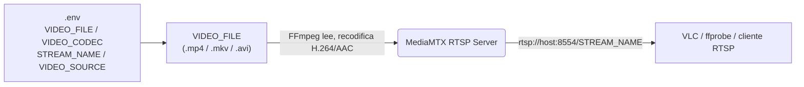

# Emulación de Cámara IP con Docker Compose

Este proyecto permite **emular una cámara IP** utilizando [MediaMTX](https://github.com/bluenviron/mediamtx) como servidor RTSP y [FFmpeg](https://ffmpeg.org/) para transmitir un video local como si fuera una cámara real.

---

## ¿Cómo funciona?



| Servicio | Descripción |
|---|---|
| `mediamtx` | Servidor RTSP que recibe y redistribuye el stream, expuesto en el puerto `8554` con TCP forzado. |
| `video-stream` | Contenedor FFmpeg que lee el archivo configurado en `.env` en bucle, lo recodifica a H.264/AAC y lo publica en MediaMTX. |

La URL resultante del stream es:

```
rtsp://<IP_de_tu_maquina>:8554/<STREAM_NAME>
```

!!! info "Reemplaza `<IP_de_tu_maquina>`"
    Usa la IP real del host donde corre Docker, no `localhost`, para que clientes externos puedan conectarse.

---

## Requisitos

- [Docker](https://docs.docker.com/get-docker/) y [Docker Compose](https://docs.docker.com/compose/) instalados.
- Un archivo de video (`.mp4`, `.mkv` o `.avi`) colocado en la carpeta `./videos`.
- Un archivo `.env` en la raíz del proyecto con las variables `VIDEO_SOURCE`, `VIDEO_FILE`, `VIDEO_CODEC` y `STREAM_NAME`.
