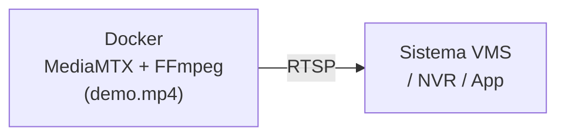

# Casos de Uso

## Pruebas de integración con sistemas de video

Emula cámaras IP reales para validar la integración con VMS (Video Management Systems), grabadores NVR, o dashboards de vigilancia, sin necesidad de hardware físico.

<div align="center">



</div>

---

## Validación de pipelines de ingestión RTSP

Prueba pipelines de procesamiento de video (reconocimiento facial, detección de objetos, análisis de tráfico) sin depender de una cámara real ni de condiciones externas.

!!! example "Ejemplo con OpenCV (Python)"
    ```python
    import cv2

    cap = cv2.VideoCapture("rtsp://<IP>:8554/mystream",
                           cv2.CAP_FFMPEG)

    while cap.isOpened():
        ret, frame = cap.read()
        if not ret:
            break
        cv2.imshow("Stream", frame)
        if cv2.waitKey(1) == ord("q"):
            break

    cap.release()
    cv2.destroyAllWindows()
    ```

---

## Simulación de múltiples cámaras

Reproduce distintos videos simultáneamente para simular un entorno multicámara. Útil para pruebas de carga o escenarios de monitoreo distribuido.

| Stream | Video | URL |
|---|---|---|
| Cámara 1 — Entrada | `entrada.mp4` | `rtsp://<IP>:8554/camera1` |
| Cámara 2 — Pasillo | `pasillo.mkv` | `rtsp://<IP>:8554/camera2` |
| Cámara 3 — Parking | `parking.avi` | `rtsp://<IP>:8554/camera3` |

Consulta la sección [Configuración → Múltiples streams](configuration.md#multiples-streams-varias-camaras) para ver el `docker-compose.yml` con variables de entorno por servicio.

---

## Entornos de CI/CD

Incluye este stack como servicio en tu pipeline de CI/CD para ejecutar pruebas end-to-end de sistemas que consumen video RTSP de forma automatizada.

```yaml title=".github/workflows/test.yml (fragmento)"
services:
  mediamtx:
    image: bluenviron/mediamtx:latest
    ports:
      - 8554:8554
    environment:
      - MTX_PROTOCOLS=tcp
```
